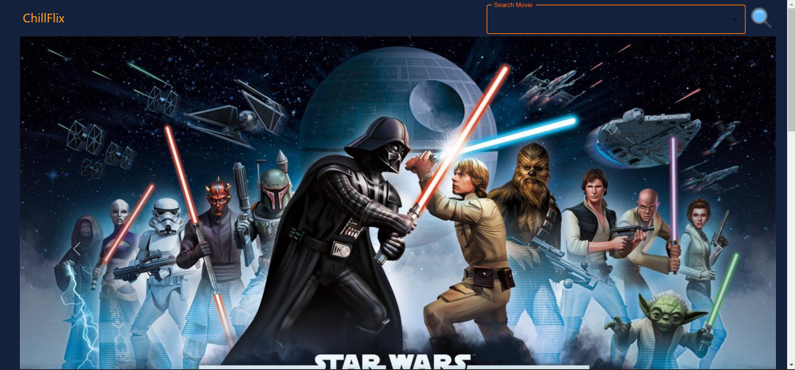
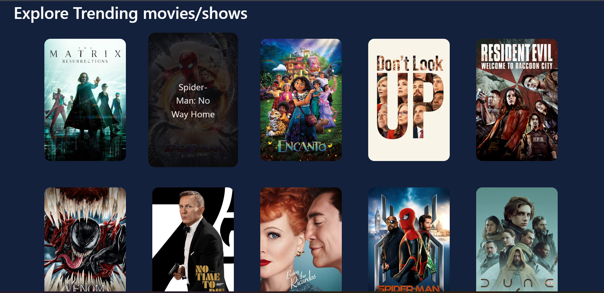
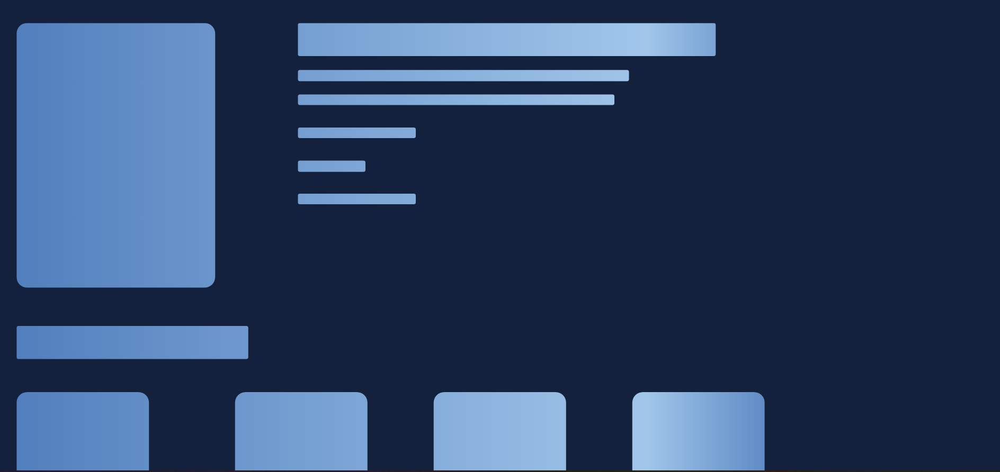
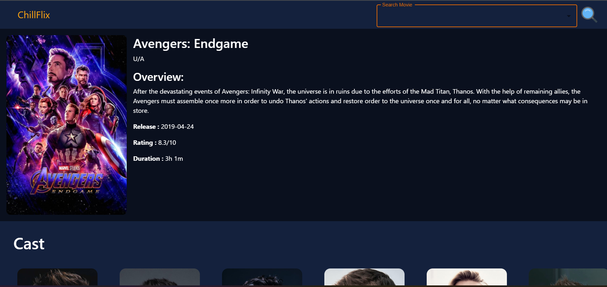
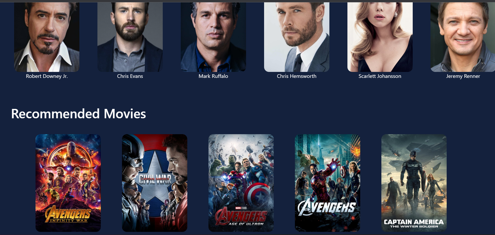

<div id="top"></div>
<!--
*** Thanks for checking out the Best-README-Template. If you have a suggestion
*** that would make this better, please fork the repo and create a pull request
*** or simply open an issue with the tag "enhancement".
*** Don't forget to give the project a star!
*** Thanks again! Now go create something AMAZING! :D
-->

<!-- PROJECT SHIELDS -->
<!--
*** I'm using markdown "reference style" links for readability.
*** Reference links are enclosed in brackets [ ] instead of parentheses ( ).
*** See the bottom of this document for the declaration of the reference variables
*** for contributors-url, forks-url, etc. This is an optional, concise syntax you may use.
*** https://www.markdownguide.org/basic-syntax/#reference-style-links
-->

<!-- PROJECT LOGO -->
<br />
<div align="center">

  <h3 align="center">Pro Recommender</h3>

  <p align="center">
    An awesome movies recommendation app to help you with your daily entertainment!
    <br />
    <br />
    <br />
  </p>
</div>

<!-- TABLE OF CONTENTS -->
<details>
  <summary>Table of Contents</summary>
  <ol>
    <li>
      <a href="#about-the-project">About The Project</a>
      <ul>
        <li><a href="#built-with">Built With</a></li>
      </ul>
    </li>
    <li>
      <a href="#getting-started">Getting Started</a>
      <ul>
        <li><a href="#prerequisites">Prerequisites</a></li>
        <li><a href="#installation">Installation</a></li>
      </ul>
    </li>
    <li><a href="#usage">Usage</a></li>
    <li><a href="#contributing">Contributing</a></li>
    <li><a href="#license">License</a></li>
  </ol>
</details>

<!-- ABOUT THE PROJECT -->

## About The Project



<br/>

<p align="right">(<a href="#top">back to top</a>)</p>

### Built With

Following libraries/frameworks have been used in this project

- [React.js](https://reactjs.org/)
- [Flask](https://flask.palletsprojects.com/en/2.0.x/)
- [Bootstrap](https://getbootstrap.com)
- [sklearn](https://scikit-learn.org/stable/)
- [Mui](https://mui.com/)

<p align="right">(<a href="#top">back to top</a>)</p>

<!-- GETTING STARTED -->

## Getting Started

This is an example of how you may give instructions on setting up your project locally.
To get a local copy up and running follow these simple example steps.

### Prerequisites

This is an example of how to list things you need to use the software and how to install them.

- npm
  ```sh
  npm install npm@latest -g
  ```

### Installation

1. Get a free API Key at [https://www.themoviedb.org/](https://www.themoviedb.org/)
2. Clone the repo
   ```sh
   git clone https://github.com/your_username_/Project-Name.git
   ```
3. Install NPM packages
   ```sh
   npm install
   ```
4. Install following python libraires
   ```sh
   pip install sklearn pandas numpy sklearn flask_cors
   ```

<p align="right">(<a href="#top">back to top</a>)</p>

<!-- USAGE EXAMPLES -->

## Usage

Browse over 16000 movies for recommendations using the subtle user interface . You can simply search for a movie or explore some trending movies as well.
Currently we have only added English movies to our data. Other langauges movies will be added soon.



<br/>



<br/>



<br/>



<p align="right">(<a href="#top">back to top</a>)</p>

<!-- ROADMAP -->

See the [open issues](https://github.com/samay-rgb/Pro-Recommender/issues) for a full list of proposed features (and known issues).

<p align="right">(<a href="#top">back to top</a>)</p>

<!-- CONTRIBUTING -->

## Contributing

Contributions are what make the open source community such an amazing place to learn, inspire, and create. Any contributions you make are **greatly appreciated**.

If you have a suggestion that would make this better, please fork the repo and create a pull request. You can also simply open an issue with the tag "enhancement".
Don't forget to give the project a star! Thanks again!

1. Fork the Project
2. Create your Feature Branch (`git checkout -b feature/AmazingFeature`)
3. Commit your Changes (`git commit -m 'Add some AmazingFeature'`)
4. Push to the Branch (`git push origin feature/AmazingFeature`)
5. Open a Pull Request

<p align="right">(<a href="#top">back to top</a>)</p>

<!-- LICENSE -->

<!-- CONTACT -->

## Contact

Saksham Yadav- [Github](https://github.com/Saksham-1508) [LinkedIn](https://www.linkedin.com/in/saksham-yadav-5604b0200/)- 20bcs191@iiitdmj.ac.in

Samay Sagar - [Twitter](https://twitter.com/https://twitter.com/Rahuldba99) [LinkedIn](https://www.linkedin.com/in/samay-sagar-a28847200/)- rahuldba99@gmail.com

Project Link: [https://github.com/samay-rgb/Pro-Recommender](https://github.com/samay-rgb/Pro-Recommender)

<p align="right">(<a href="#top">back to top</a>)</p>

<!-- ACKNOWLEDGMENTS -->
